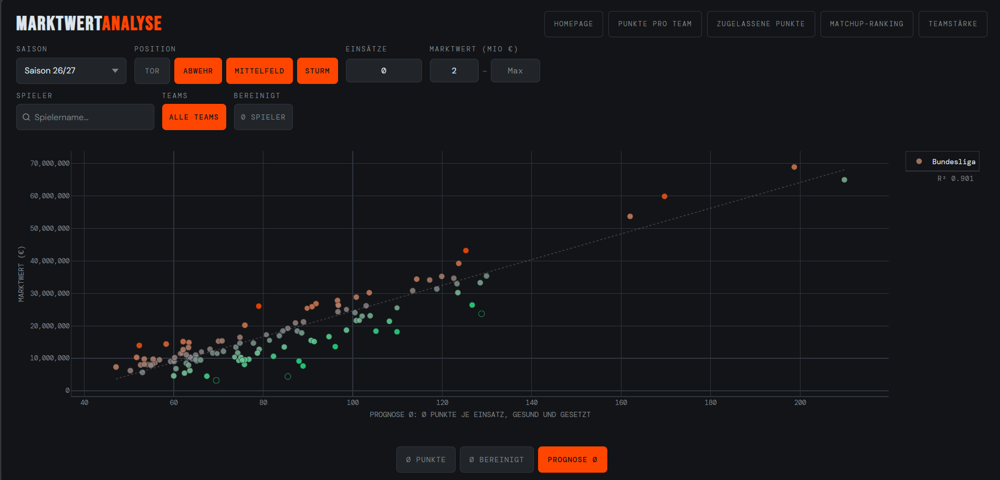
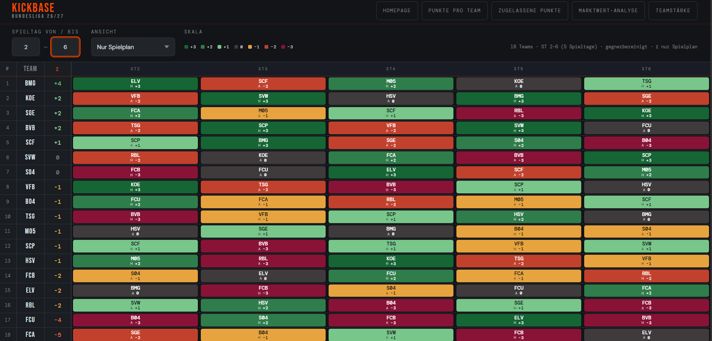
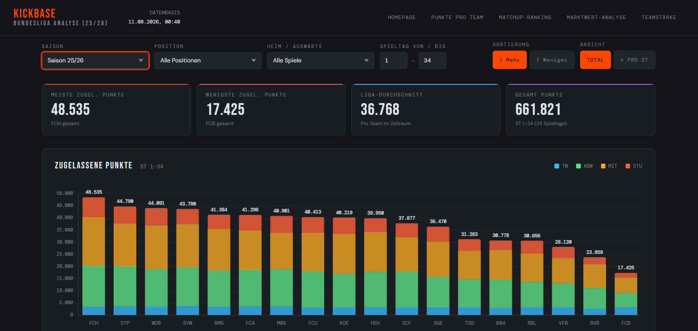
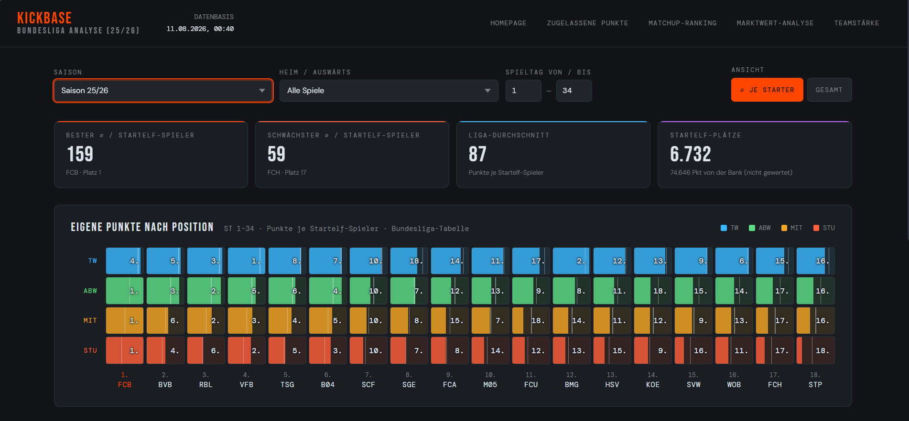
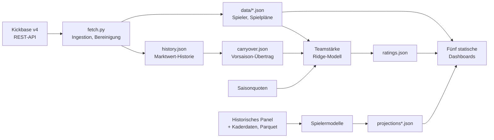

# Kickbase Tools

[](https://github.com/noltinho/kickbase-analytics/actions/workflows/ci.yml)

**[▶ Live-Demo öffnen](https://noltinho.github.io/kickbase-analytics/)** — fünf
Analysewerkzeuge für Bundesliga und 2. Bundesliga, direkt im Browser, ohne
Installation und ohne Login.

## Das Problem

Im Kickbase-Manager entscheidet der Marktwert. Er ist die einzige Zahl, die
jeder Mitspieler sieht — und er erklärt die spätere Punkteausbeute nur grob:
Über 1.571 Starter-Spielersaisons kommt eine reine Marktwert- und
Positionsschätzung auf einen mittleren absoluten Fehler von **19,28 Punkten**.

Dieses Projekt misst stattdessen. Ein gegnerbereinigtes Teamstärkemodell
bewertet, wie schwer ein Spielplan wirklich ist. Ein Spielermodell schätzt den
Punkteschnitt eines gesetzten Spielers aus seiner Historie, seinem Umfeld und
seiner Position — und macht dabei **13,7 % weniger Fehler** als der
Marktwert allein.

[](https://noltinho.github.io/kickbase-analytics/scatter.html)

<sub><b>Marktwert-Analyse.</b> Jeder Punkt ein Spieler: Marktwert gegen den
prognostizierten Punkteschnitt je Einsatz (Bundesliga 2026/27, Feldspieler ab
2 Mio. €). Wer deutlich unter der Regressionsgeraden liegt, ist für seine
erwartete Leistung günstig.</sub>

> Inoffizielles, nicht mit Kickbase oder Transfermarkt verbundenes Forschungs-
> und Portfolio-Projekt. Hinweise zu Fremddaten und Marken stehen in
> [NOTICE.md](NOTICE.md).

## Die Werkzeuge

Jede Oberfläche beantwortet genau eine Frage.

### Welche Spieltage werden leicht, welche schwer?

[](https://noltinho.github.io/kickbase-analytics/score.html)

<sub><b>Matchup-Ranking.</b> Der Spielplan jedes Teams von −3 bis +3, aus dem
gegnerbereinigten Teamstärkemodell abgeleitet (Bundesliga 2026/27, Spieltage 2
bis 6). Zu sehen ist die reine Gegnerstärke; die Paarungsstärke lässt sich
umschalten. Voreingestellt ist der Zeitraum vom nächsten Spieltag bis zum Ende
der Hinrunde — der Horizont, über den ein Kader geplant wird. Für dieses Bild
ist er auf fünf Spieltage gekürzt, damit das Raster lesbar bleibt.</sub>

### Gegen wen lohnt sich welche Position?

[](https://noltinho.github.io/kickbase-analytics/matchup.html)

<sub><b>Zugelassene Punkte.</b> Wie viele Punkte eine Mannschaft ihren Gegnern
erlaubt, aufgeschlüsselt nach Mannschaftsteil und wahlweise nach Position und
Spielort (Bundesliga 2025/26, alle 34 Spieltage). Zwischen der durchlässigsten
und der stabilsten Defensive der Liga liegt fast der Faktor drei — 48.535 gegen
17.425 Punkte.</sub>

### Wo im Kader entstehen die Punkte überhaupt?

[](https://noltinho.github.io/kickbase-analytics/teampunkte.html)

<sub><b>Punkte pro Team.</b> Erzielte Punkte je Startelf-Spieler, nach
Mannschaftsteil und Tabellenplatz (Bundesliga 2025/26). Die Zahl in jedem Feld
ist der Ligarang des Vereins auf dieser Position. Wechselnde Spieler werden über
den Spielplan aufgelöst — die Punkte eines Wintertransfers zählen zum Verein,
für den er an dem Spieltag tatsächlich auflief.</sub>

### Zwei weitere Ansichten

- **Teamstärke-Editor** — eigene Einschätzung gegen das Modell setzen, ohne die
  berechnete Basis zu verlieren. Abweichungen werden als Differenz gespeichert
  und auf jede neue Modellbasis übertragen.
- **Marktwert-Analyse** — das Bild oben, wahlweise gegen erzielte, bereinigte
  oder prognostizierte Durchschnittspunkte.

Alle Seiten sind statische Dateien. Sie laden ausschließlich versionierte
JSON-Dateien aus `data/`; persönliche Logins oder Zugangsdaten gelangen nie ins
Frontend.

## Was belegt ist

Prognostiziert wird der Punkteschnitt je Einsatz unter der Bedingung, dass ein
Spieler in der Zielsaison gesetzt ist. Die Evaluation ist strikt walk-forward:
Für jede Zielsaison werden nur Informationen verwendet, die vor deren Beginn
bekannt waren.

| Modell | MAE | |
|---|---:|---|
| **Fallweises Spielermodell** | **16,64** | **13,7 % weniger Fehler** als die Baseline |
| Marktwert-/Positionsbaseline | 19,28 | Vergleichslinie ohne eigene Spielerhistorie |

- **1.571 Starter-Spielersaisons** über die Zielsaisons 2019–2025
- Paarweiser Vorsprung **2,64 MAE-Punkte**, saisongeclustertes
  95-%-Intervall **2,23 bis 3,00**
- Gewinnt in **7 von 7** Zielsaisons

Verglichen wurden außerdem Ridge, Spline-Ridge, Extra Trees, Gradient Boosting
und ein empirisches Bayes-Modell. Der vollständige Vergleich steht in
[kbxp/player-benchmark.md](kbxp/player-benchmark.md) — dort stehen auch die
Grenzen: die Fälle, in denen das Modell verzerrt schätzt, und der eine Bereich,
in dem stumpfes Sortieren nach Vorjahrespunkten knapp vorn liegt.

## Wie es gebaut ist



Zwei getrennte Welten: Die Produktionspipeline in `fetch.py` kommt mit
`requests` aus und schreibt alle veröffentlichten JSON-Dateien atomar. Die
Forschung unter `kbxp/` nutzt pandas, NumPy, SciPy, PyArrow und scikit-learn.
Das Frontend verwendet kein Framework, keinen Bundler und keinen Buildschritt.

Eine CI-Pipeline prüft bei jedem Push Datenverträge und Plausibilität: dass
Saisonmanifest, Spielpläne und Spieltagsdaten zueinander passen, dass erzielte
und zugelassene Punkte sich gegenseitig aufgehen, dass Wechsler dem richtigen
Verein zugeordnet werden, dass Formularelemente zugängliche Namen haben und
externe Skripte versionsgepinnt mit Integritätsprüfung geladen werden.

<details>
<summary><b>Installation, Tests und Datenaktualisierung</b></summary>

### Lokal ansehen

Direktes Öffnen per `file://` funktioniert wegen der Browser-Sicherheitsregeln
für `fetch()` nicht zuverlässig. Im Projektverzeichnis genügt ein lokaler
Webserver:

```bash
python -m http.server 8000
```

Danach `http://localhost:8000/` öffnen.

### Installation und Tests

```bash
python -m venv .venv
# Windows: .venv\Scripts\activate
# macOS/Linux: source .venv/bin/activate
python -m pip install -r requirements.lock

python -m pytest -m "not slow"
npm run test:frontend
```

Die schnelle Suite ist für CI gedacht. Rechenintensive Monte-Carlo- und
Forschungstests laufen zusätzlich mit:

```bash
python -m pytest
```

`requirements.lock` hält den geprüften Stand exakt fest; `requirements.txt`
enthält die bewusst breiteren direkten Anforderungen für kontrollierte
Aktualisierungen.

`kbxp/data/manual/tm_players.csv` wird bewusst nicht veröffentlicht. Tests, die
den vollständigen Transfermarkt-Crawl benötigen, werden in einem frischen Klon
mit sichtbarer Begründung übersprungen. Die übrigen Daten- und Modellverträge
bleiben prüfbar.

### Daten aktualisieren

Zugangsdaten gehören ausschließlich in Umgebungsvariablen oder eine lokale
`.env`-Datei; beides wird von Git ignoriert. `.env.example` zeigt das Format.

```bash
python fetch.py                         # laufende Saison
python fetch.py mv                      # Marktwert-Historie verdichten
python fetch.py carryover               # ohne Login
python fetch.py ratings                 # ohne Login
python fetch.py archive --season 2526   # abgeschlossene Saison
```

Der Fetcher schreibt veröffentlichte JSON-Dateien atomar. Ein Abbruch während
des Schreibens beschädigt daher insbesondere die nicht nachholbare
`history.json` nicht.

Das fallweise Spielermodell lässt sich getrennt für beide Ligen exportieren:

```bash
cd kbxp
python -m src.model.player_avg                  # Liga 1
python -m src.model.player_avg --liga 2         # Liga 2
python -m src.model.player_avg --liga 2 --backtest
```

</details>

## Modellierung im Detail

Die Teamstärke wird als Ridge-Modell geschätzt:

```text
zugelassene Punkte = Ligamittel + eigene Abwehr + gegnerischer Angriff + Heimvorteil
```

Marktquoten dienen als Vorsaison-Prior; ihre mehrminütige Monte-Carlo-Inversion
wird anhand aller fachlichen Eingänge gecacht.

Die Spielermodelle beantworten zwei getrennte Fragen: Ein Rollenmodell zerlegt
den Ertrag in Qualität und erwartete Einsatzzeit, das fallweise Modell schätzt
den Punkteschnitt für gesetzte Spieler abhängig von verfügbarer Historie. Beide
Ligen teilen dieselbe fachliche Struktur, fitten Koeffizienten, Teamniveaus und
Kalibrierung aber getrennt. In Liga 2 ersetzt eine walk-forward geprüfte
Starter-Logistik die dort fehlenden handgepflegten Kategorien.

Architektur, Datenfluss und Forschungskommandos sind in [AGENTS.md](AGENTS.md)
dokumentiert, der unabhängige Modellvergleich in
[kbxp/player-benchmark.md](kbxp/player-benchmark.md).

## Repository-Struktur

```text
fetch.py                 Produktions-Fetcher und JSON-Exporte
common.js                gemeinsame Saison-, Rating- und Score-Logik
frontend-utils.js        kleine, separat testbare Frontend-Datenfunktionen
*.html                   Startseite und fünf statische Werkzeuge
data/                    veröffentlichte Anwendungsdaten und Modell-Exporte
kbxp/src/                Ingest-, Feature- und Modellcode
kbxp/tests/              Leakage-, Güte- und Datenvertragstests
.github/workflows/ci.yml Syntax-, Frontend- und Python-CI
```

## Lizenz

Der selbst entwickelte Quellcode steht unter der MIT-Lizenz. Die Lizenz erfasst
nicht automatisch Daten, Datenbanken, Namen, Marken oder Inhalte Dritter; siehe
[LICENSE](LICENSE) und [NOTICE.md](NOTICE.md).
